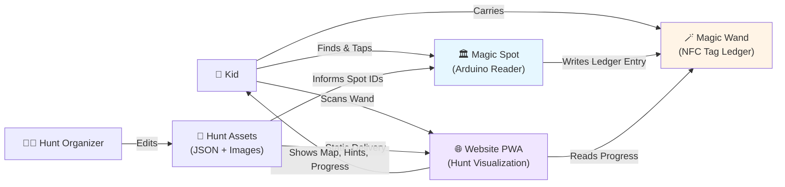
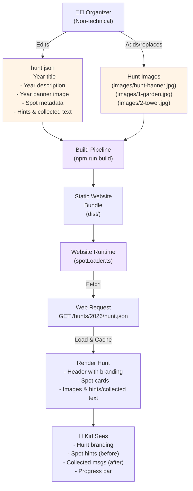
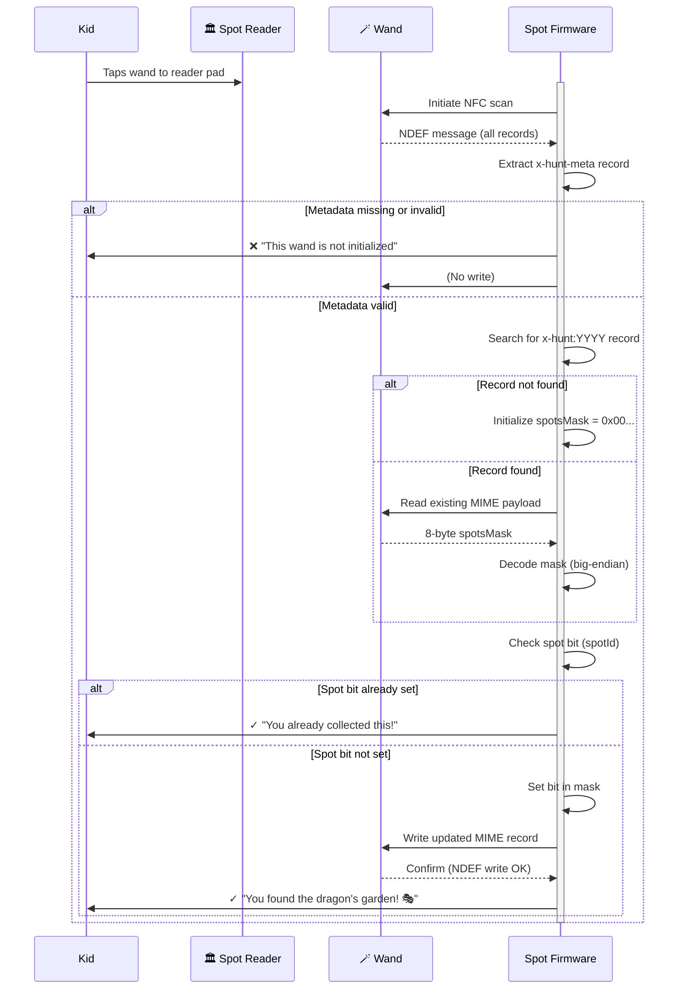
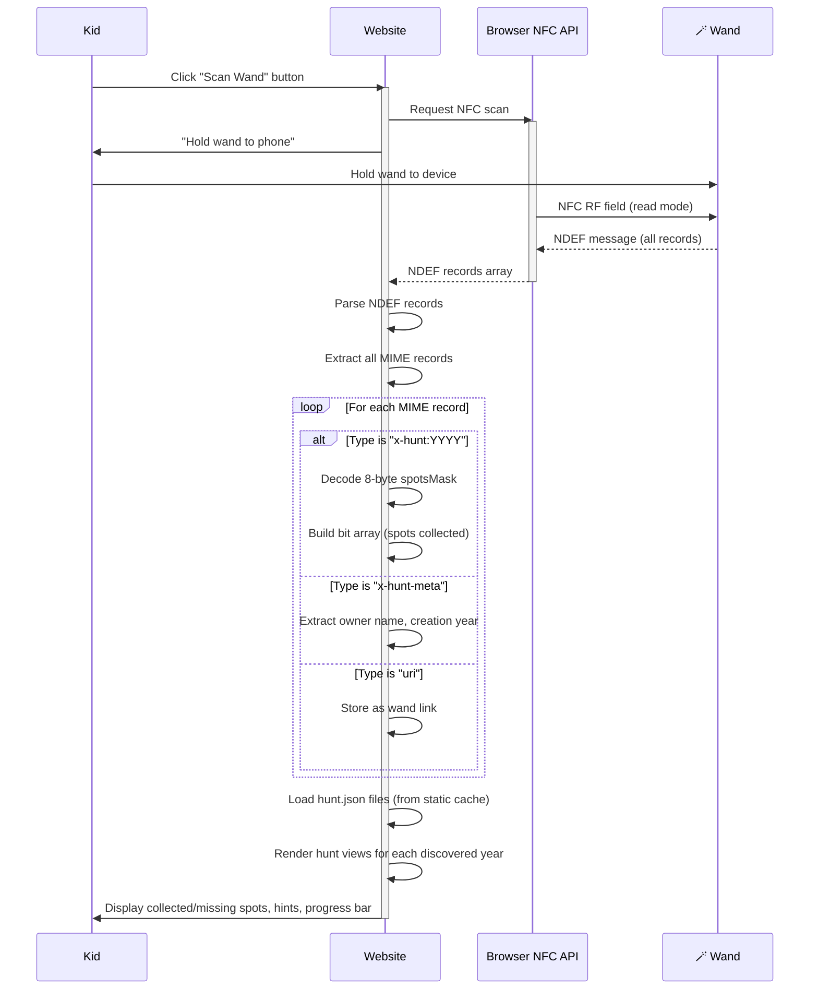
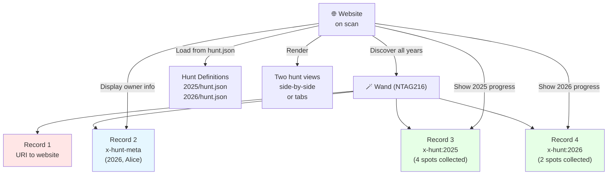
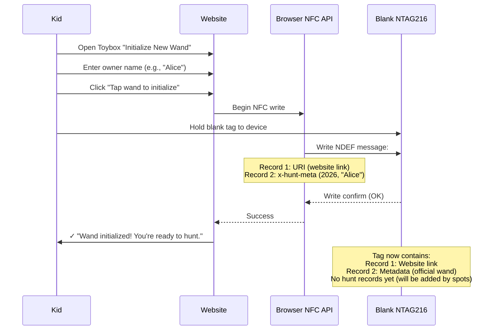

# Tryllestavsprojekt: System Architecture

This document explains how the system components interact, where responsibility boundaries lie, and how data flows through the system. Diagrams are provided for architecture, user flows, and delivery phases.

---

## System Context Diagram



---

## Responsibility Boundaries

### `arduino/` (Spot Writers)

**Owns:**

- Spot reader hardware (PN532 via I2C, or RC522 via SPI)
- Wand ledger writes: append spot IDE to yearly hunt record
- Metadata verification: check wand has valid `x-hunt-meta` before writing
- Device diagnostics: serial console, test reports, troubleshooting guides

**Does NOT own:**

- Hunt content (spot names, hints, images)
- Website presentation logic
- Record 1 configuration UI
- Browser compatibility

**Key decision:** Spot firmware is stateless. It knows only the current year and spotId (via serial config), not the hunt's total spot count or names. Validation and progress visualization are the website's job.

### `website/` (Hunt Companion App)

**Owns:**

- Wand scanning UX and error messages
- Hunt progress visualization (which spots collected, which missing)
- Hint and context presentation
- Browser compatibility messaging
- Record 1 toy configuration (Toybox UI)
- Hunt asset delivery (JSON + images)

**Does NOT own:**

- On-tag write logic
- Spot identification logic
- Metadata verification
- Hardware interaction

**Key decision:** Website is read-only for hunt data. It displays collected progress but never initiates writes to the wand. Writes come only from physical spot readers.

### Both Own (Shared Contract)

- **Hunt record MIME type:** `application/x-hunt:<YYYY>`
- **Spot mask format:** 8-byte big-endian bitmask
- **Record 1 preservation:** Never written to by hunt logic
- **Metadata record:** `x-hunt-meta` for wand authentication
- **Yearly hunt boundaries:** Each year is a separate record; no shared state

---

## Hunt Asset Delivery: Non-Technical Authorship



**Key point:** Non-technical organizers edit JSON and add images. No code changes needed. Website auto-discovers new hunt years at build time.

---

## Spot Write Flow (Detailed)



---

## Website Scan & Visualization Flow



---

## Multi-Year Wand: Data Coexistence

One wand contains multiple hunt years:



**Key:** Records are discovered by MIME type and year, not by position. A wand with 10 years of hunts still works perfectly — website fetches all `x-hunt:*` records and loads corresponding year metadata from JSON.

---

## Record Layout & Byte Budget

Typical wand over 10 years of hunts:

```
Total writable space (assumption): ~888 bytes

Record 1 (URI):
  NDEF TLV overhead: ~12 bytes
  Payload: "https://example.com" (~20–40 bytes)
  Subtotal: ~35 bytes

Record 2 (x-hunt-meta):
  NDEF TLV overhead: ~12 bytes
  Payload: 2 bytes (year) + 1 byte (length) + ~6 bytes (owner name "Alice")
  Subtotal: ~22 bytes

Records 3–13 (10 years of hunts, one per year):
  Each: NDEF TLV (~10 bytes) + 8-byte payload = ~18 bytes per year
  Subtotal: 10 × 18 = ~180 bytes

Total: 35 + 22 + 180 = ~237 bytes used
Remaining: ~651 bytes free (for future expansion)
```

This leaves ample room for:

- Metadata future extensions (e.g., per-spot achievement data)
- Additional user NFC records
- Larger owner names or wand descriptions

---

## Responsibility Boundary: Record 1

Record 1 is **user-owned NFC space**. Hunt logic never touches it.

```
┌─────────────────────────────────────────┐
│ Record 1: User NFC Action               │
│ ─────────────────────────────────────── │
│ Examples:                               │
│  • Open website link                    │
│  • Share contact info                   │
│  • Emergency info (lost wand)           │
│  • School project data                  │
└─────────────────────────────────────────┘
       ↑ RESERVED ↑
       NEVER written by hunt internals
       Configurable via Toybox UI

┌─────────────────────────────────────────┐
│ Records 2–N: Hunt Data                  │
│ ─────────────────────────────────────── │
│ • Metadata (x-hunt-meta)                │
│ • Yearly hunts (x-hunt:YYYY)            │
│ ─────────────────────────────────────── │
│ Changes only via spot writers           │
│ Read by website (display only)          │
└─────────────────────────────────────────┘
```

**Why?** A child should be able to:

1. Tap a wand on a spot and collect (hunts write only to records 2+)
2. Scan the wand on website and see progress (website reads records 2+)
3. Configure record 1 with a personal NFC action via Toybox (website writes record 1 only)
4. Never have their personal link overwritten by hunt logic

---

## Wand Initialization: Blank → Official Wand

When a child gets a blank tag and scanst it on the website Toybox UI:



**After initialization:** Wand is "official" (has metadata) and can be written to by spot readers.

---

## Error Handling & Safety

### Guard Conditions

Spot firmware includes these safety checks:

1. **Metadata must be present**
   - If `x-hunt-meta` missing → refuse write
   - Prevents writing to random tags

2. **Data loss prevention**
   - If existing NDEF cannot be fully read → probe blank pages
   - If pages are non-blank but unreadable → refuse write
   - If pages are blank → safe to initialize
   - Prevents transient read failures from clearing collected spots

3. **MIME record validation**
   - If year is outside expected range (1900–2100) → skip
   - If spot ID is outside 1–64 → reject
   - If payload is not exactly 8 bytes → malformed; don't write

### Website Error Handling

1. **Browser NFC not supported**
   - Display friendly message
   - Suggest alternative devices/browsers

2. **Wand not found after timeout**
   - Cancel gracefully
   - Offer retry

3. **Wand metadata missing**
   - Display: "This wand isn't initialized. Use Toybox first."

4. **Malformed hunt record**
   - Log to console
   - Display: "Some hunt data is unreadable. Contact support."

---

## Scalability & Future Evolution

### Hunt Size Limits

| Limit               | Value     | Notes                                                          |
| ------------------- | --------- | -------------------------------------------------------------- |
| Spots per year      | 64        | 8-byte bitmask limit; could expand to 128 with 16-byte payload |
| Years on one wand   | ~10–15    | With 888-byte budget and ~18–22 bytes per year                 |
| Hunt organizers     | Unbounded | Static JSON; no server bottleneck                              |
| Concurrent scanners | Unbounded | Tags handle multiple readers; no sync issues                   |

### Potential Future Extensions

**Without changing the core format:**

- Larger metadata (e.g., wand decoration data, achievement badges)
- Multi-language hunt descriptions in JSON
- Spot-level achievements or collectibles (stored in website, keyed by wand metadata)

**With format evolution (if needed post-launch):**

- Expand bitmask to 16 bytes (128 spots per year)
- Add per-spot achievement metadata to MIME payload
- Support hierarchical spot groups (e.g., "Chapter 1: Spots 1–10")

See [docs/03-TECHNICAL-PROTOCOL.md](03-TECHNICAL-PROTOCOL.md#version--evolution-rules) for format evolution rules.

---

## References

- **On-tag protocol details:** [docs/03-TECHNICAL-PROTOCOL.md](03-TECHNICAL-PROTOCOL.md)
- **Build & deployment:** [docs/05-BUILD-AND-DEPLOY.md](05-BUILD-AND-DEPLOY.md)
- **Vision & design principles:** [docs/02-VISION-AND-PURPOSE.md](02-VISION-AND-PURPOSE.md)
- **Code references:**
  - Website NFC: `website/src/composables/useNfc.ts`
  - Spot firmware: `arduino/NFC_Basic/NFC_Basic.ino`
  - Hunt asset loading: `website/src/utils/spotLoader.ts`
