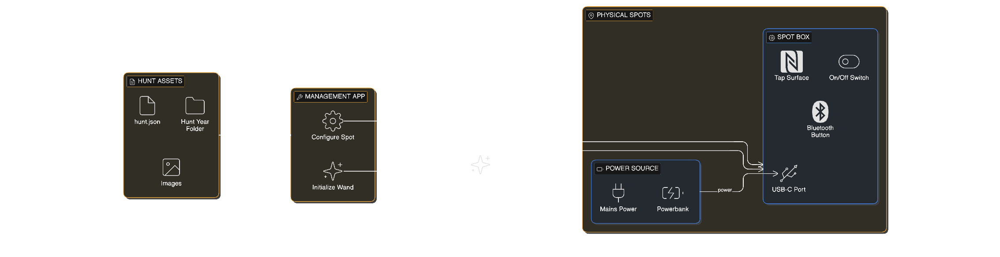

# Tryllestavsprojekt — Event Organiser Manual

> **Who this is for:** The people setting up and running the treasure hunt. No coding knowledge required.

---

## Table of Contents

1. [What Is Everything? — Glossary & Overview](#1-what-is-everything)
2. [Before the Hunt — Preparation](#2-before-the-hunt)
   - [2.1 Adding a New Hunt Year](#21-adding-a-new-hunt-year)
   - [2.2 Setting Up Spots Physically](#22-setting-up-spots-physically)
   - [2.3 Configuring Spots with the Management App](#23-configuring-spots-with-the-management-app)
3. [On the Day — Running the Hunt](#3-on-the-day)
   - [3.1 Initialising Wands](#31-initialising-wands)
   - [3.2 Guiding Kids to Use the Website](#32-guiding-kids-to-use-the-website)
   - [3.3 Troubleshooting in the Field](#33-troubleshooting-in-the-field)

---

## 1. What Is Everything?

Here is a quick map of every piece of the system — what it is, what it does, and how it relates to everything else.

---

### The Wand 🪄

```
  ╔══════════════════════════════════════╗
  ║  Wooden wand (hand-turned hardwood)  ║
  ║                                      ║
  ║   Tip ──► tiny glass capsule         ║
  ║            (NFC chip inside)         ║
  ╚══════════════════════════════════════╝
```

A hand-crafted wooden wand with a tiny passive NFC chip sealed inside the tip. "Passive" means it has no battery — it gets its power wirelessly from a reader when tapped. The wand stores everything: the child's name, the year it was created, and every spot they have ever collected. **The wand IS the save file.** Nothing is stored on a server or in the cloud.

Each wand is personal to one child and can be used year after year. Collected spots from previous hunts stay on the wand alongside new ones.

---

### A Magic Spot 🏛️

```
  ┌──────────────────────────────────┐
  │  Physical plaque or sign         │
  │  at a location in the city       │
  │                                  │
  │  ┌──────────────────────────┐    │
  │  │  Spot box (3D printed)   │    │
  │  │                          │    │
  │  │  ┌──────────────────┐    │    │
  │  │  │  tap surface  ◎  │    │    │  ← wands tap here
  │  │  └──────────────────┘    │    │
  │  │                          │    │
  │  │  [on/off switch]         │    │
  │  │  [USB-C port]  ←─ power  │    │
  │  │  [· Bluetooth hole]      │    │
  │  └──────────────────────────┘    │
  └──────────────────────────────────┘
```

A magic spot is a physical location — a mural, statue, fountain, landmark — that has been fitted with a spot box. When a child taps their wand against the tap surface on the box, the spot recognises the wand and writes proof of the visit onto it. The whole process takes about one second and works with no internet connection.

---

### The Spot Box

A compact 3D-printed enclosure housing all the electronics for one spot. From the outside, you will see:

```
  ┌───────────────────────────────────────┐
  │                                       │
  │          ◎  tap surface               │
  │                                       │
  │    ──────────────────────────────     │
  │                                       │
  │   [  ○  ]    [USB-C]    [  ·  ]       │
  │  on/off       power     Bluetooth     │
  │  switch       input     pinhole       │
  └───────────────────────────────────────┘
```

- **Tap surface** — where wands are held to collect a spot
- **On/off switch** — turns the spot on and off
- **USB-C port** — where power comes in (mains cable or powerbank)
- **Bluetooth pinhole** — a small hole for pressing the Bluetooth button with a toothpick or paperclip

That is everything an organiser needs to interact with. The electronics inside are fully enclosed and do not need to be touched.

---

### The Website / PWA 🌐

The companion website that children use to see their progress. It works in Chrome on Android. When a child scans their wand on the website, it shows:

- Their name and when the wand was created
- Which spots they have collected (with images and story text)
- Which spots they are still missing (with hints)
- Progress across previous years if they have an older wand

"PWA" stands for Progressive Web App — it means the website can be installed to a phone's home screen and used like a normal app, without going through an app store.

> **Important:** Web NFC (the technology that lets a website read NFC tags) currently only works on Android devices using Chrome. iPhones cannot scan wands through the website. This is a browser limitation, not something we can change.

---

### The Management App 🛠️

A separate section of the website, found at `/management/`, used by organisers (not children). It has two tools:

- **Initialize Wand** — prepares a blank NFC tag to become an official wand
- **Configure Spot** — connects to a spot box and sets its spot ID and hunt year

---

### Hunt Assets (the content files) 📄

For each hunt year, there is a folder of files that defines what the hunt looks like on the website: the hunt title, the banner image, and for each spot — its name, hint, collected message, photo, and location. Organisers edit these files to create or update a hunt. No coding is required. Once the files are saved to the repository, the website updates itself automatically.

---

### Glossary

| Term               | Meaning                                                                                                                |
| ------------------ | ---------------------------------------------------------------------------------------------------------------------- |
| **NFC**            | Near-Field Communication — the wireless technology that lets the wand and reader talk to each other at close range     |
| **Tag**            | The tiny NFC chip inside the wand tip                                                                                  |
| **Initialise**     | The process of writing the owner name and website link onto a blank tag for the first time, making it an official wand |
| **Spot box**       | The 3D-printed enclosure at each spot location containing all the electronics                                          |
| **Spot ID**        | A number (1–64) that identifies a specific spot within a hunt year                                                     |
| **Hunt year**      | Each year's hunt is separate. A wand collects spots for each year independently                                        |
| **Management app** | The organiser tools at `/management/`                                                                                  |
| **PWA**            | Progressive Web App — the installable version of the companion website                                                 |
| **Power cycle**    | Turning a spot off and on again — the fix for most hardware problems                                                   |

## 

## 2. Before the Hunt

### 2.1 Adding a New Hunt Year

Full details are in the **Hunt Folder README** (`website/public/hunts/README.md`). The short version:

1. **Create a new folder** named after the year inside `website/public/hunts/`

   ```
   website/public/hunts/
   ├── 2026/          ← existing
   │   ├── hunt.json
   │   └── images/
   └── 2027/          ← new folder you create
       ├── hunt.json
       └── images/
   ```

2. **Copy `hunt.json`** from the previous year's folder into the new one and edit it — change the year, title, description, banner image, and all spot entries.

3. **Add images** to the `images/` subfolder — one banner image and one image per spot.

4. **Save the files to the repository.** The website will update itself automatically within a few minutes — no developer intervention needed.

> 📖 For the full content format and all available fields, see `website/public/hunts/README.md`.

---

### 2.2 Setting Up Spots Physically

Each spot box needs only one thing from you: power via USB-C.

```
  Power source
       │
       │ USB-C cable
       ▼
  ┌─────────────────────┐
  │     Spot box        │
  │                     │
  │  ◎  tap surface     │
  │                     │
  │  [on] [USB-C] [·]   │
  └─────────────────────┘
```

#### Power options

**Option A — Mains power**

```
  Wall socket
      │
  USB-C phone charger (5V — any standard charger)
      │  up to ~5 metres of cable
      │
  Spot box USB-C port
```

Best for spots where you have access to a power socket. The spot will run indefinitely.

**Option B — Powerbank**

```
  Powerbank
      │
  USB-C cable
      │
  Spot box USB-C port
```

Best for locations without mains power. A standard 10,000 mAh powerbank will run a spot for roughly 24–48 hours. Budget at least one full charge per event day.

> ⚠️ **Powerbank auto-off:** Some powerbanks automatically cut power to devices that draw very little current. If a spot stops working after 30–60 minutes despite the powerbank having charge, try a different powerbank — ideally one that supports "always-on" or "low-current" mode. This is the most common powerbank-related problem.

#### Turning a spot on

Flip the on/off switch. The spot takes about 10 seconds to fully start up. After that it is ready for wands.

#### If a spot is not working

**Power cycle it.** This is the fix for all hardware problems:

```
  1. Flip the switch to OFF  (or unplug USB-C if no switch is accessible)
         │
         ▼  wait 10 seconds
  2. Flip the switch to ON
         │
         ▼  wait 10 seconds
  3. Test with a wand
```

If power cycling does not fix it, connect to the spot via the management app and read the terminal log to find out what is happening (see section 3.3).

---

### 2.3 Configuring Spots with the Management App

Each spot needs to know two things:

- **Which spot ID it is** (e.g. spot 3 = "The Dragon's Garden")
- **Which hunt year** it is writing for (e.g. 2026)

These are set using the **Configure Spot** tool in the management app. You can connect via USB (easier at a desk before deployment) or Bluetooth (useful once a spot is installed in its location).

#### Opening the management app

Go to the companion website and add `/management/` to the URL:

```
  https://your-website-url.com/management/
```

Then tap **Configure Spot** in the bottom navigation.

---

#### Connecting via USB

```
  Your phone or laptop
         │
    USB-C cable (or USB-C OTG adapter for phones)
         │
    Spot box USB-C port
```

1. Plug the spot box into your device
2. Open the management app in **Chrome** (important — this will not work in Safari or Firefox)
3. Tap **Connect USB**
4. A pop-up appears asking which port to use — select the one that appears (usually labelled something like "USB JTAG" or "CP210x")
5. Wait about 3 seconds — the terminal will show the device starting up and its current settings:

```
  ┌─────────────────────────────────────────┐
  │ Received Data                           │
  │                                         │
  │ PN532 spot writer (C3 Mini, I2C + BLE)  │
  │ Configured spotId=3 huntYear=2026       │
  │ Ready. Present NTAG216 tag.             │
  └─────────────────────────────────────────┘
```

---

#### Connecting via Bluetooth

Use this method when a spot is already mounted and a USB cable is not practical.

```
  Step 1: Insert a toothpick or paperclip
          into the Bluetooth pinhole

  ┌───────────────────────────────────────┐
  │  ◎  tap surface                       │
  │                                       │
  │  [on] [USB-C]  [·] ◄── press and hold │
  └───────────────────────────────────────┘
```

1. **Press and hold** the button through the Bluetooth pinhole using a toothpick or paperclip — keep holding
2. While holding, open the management app and tap **Connect Bluetooth**
3. A pop-up shows nearby devices — select **NFC Config**
4. Once connected, release the toothpick
5. The terminal will confirm the connection and show the current config

> 📍 You must press the button _before_ tapping Connect Bluetooth. The button tells the spot to start advertising — without it, the device will not appear in the list.

---

#### Setting the spot ID and year

Once connected, use the dropdowns to set the correct values:

```
  ┌──────────────────────────────────────┐
  │  Hunt Year    [ 2026 ▾ ]             │
  │               The Dragon's Quest     │  ← hunt name appears automatically
  │                                      │
  │  Spot ID      [    3 ▾ ]             │
  │               The Dragon's Garden    │  ← spot name appears automatically
  └──────────────────────────────────────┘
```

Each selection is sent to the device immediately. You will see confirmation in the terminal:

```
  OK: spotId = 3
  OK: huntYear = 2026
  CONFIG:3,2026
```

> ✅ The configuration is saved permanently inside the spot box. It survives power cuts and restarts — you only need to set it once per spot per year.

---

#### Verifying a spot works

After configuring, test the full loop before deploying the spot:

1. Take an **initialised wand** (see section 3.1)
2. Hold the wand tip against the tap surface
3. Watch the terminal — a successful write looks like this:

```
  Tag UID(7): 04:A1:B2:C3:D4:E5:F6
  Owner verified: 'Alice' (created 2026)
  SUCCESS: spot 3 written to year 2026
```

4. Open the **companion website** on an Android phone, scan the same wand, and confirm spot 3 appears as collected under the 2026 hunt

If you see an error instead, see section 3.3 (Troubleshooting).

---

## 3. On the Day

### 3.1 Initialising Wands

Every wand must be **initialised** before it can be used. Initialisation writes two things onto the blank chip inside:

- The **owner's name** (the child's name)
- The **companion website URL** (so tapping the wand on a phone opens the website)
- The **creation year** (so the website knows when the wand was made)

An uninitialised wand is invisible to the spot boxes — they will refuse to write to it.

#### What you need

- An Android phone with Chrome
- The management app open at `/management/`
- The blank wands

#### The process

```
  ┌─────────────────────────────────────────────────┐
  │  Management App — Initialize Wand tab           │
  │                                                 │
  │  Owner name   [ Alice_______________ ]          │
  │                                                 │
  │  Creation year  [ 2026 ▾ ]                      │
  │                                                 │
  │           [ 🪄 Initialize Wand ]                │
  └─────────────────────────────────────────────────┘
```

1. Go to the **Initialize Wand** tab in the management app
2. Type the child's name in the **Owner name** field
3. Confirm the **Creation year** is correct (it defaults to the current hunt year)
4. Tap **Initialize Wand**
5. Hold the wand tip to the **back of the phone**, near the centre

```
  Phone (back)
  ┌───────────────┐
  │               │
  │   ◉  NFC  ◉   │  ← hold wand tip here
  │               │
  └───────────────┘
        ↑
   wand tip (glass capsule end)
```

6. You will see a success message and the name field clears automatically
7. Type the next child's name and repeat

> 💡 **Speed tip:** For mass initialisation before an event, keep one phone running the management app and have a second person handing wands to you. A wand takes about 2 seconds to write. With practice you can initialise one every 5–10 seconds.

> ⚠️ **NFC location varies by phone.** On most Android phones the NFC antenna is in the centre-back of the phone. If the write fails, try moving the wand tip slightly up or down. The sweet spot is usually just above centre.

#### What if a wand from a previous year needs re-initialising?

If a child returns with a wand from last year, do not re-initialise it unless the wand has a problem. Re-initialising updates the owner name and creation year, but **all previous hunt data is preserved**. The child's old collected spots are safe.

---

### 3.2 Guiding Kids to Use the Website

#### What the child needs

- An Android phone (theirs, a parent's, or a shared device at the event)
- Chrome browser (pre-installed on Android)
- The companion website URL

#### The scanning flow

```
  Child opens the website in Chrome on Android
             │
             ▼
  A pop-up asks: "Enable Wand Scanner?"
             │
             ▼ Tap "Enable NFC"
             │
             ▼
  "Hold your wand close to begin your magical adventure!"
             │
             ▼ Hold wand tip to back of phone
             │
             ▼
  Wand detected — name and wand age appear
  Hunt progress shown — collected spots and hints for missing ones
```

#### Installing the website as an app (recommended)

The website can be installed to the home screen so it works like a real app — faster to open and no need to type the URL each time.

In Chrome on Android:

1. Open the website
2. Tap the **three-dot menu** (top right)
3. Tap **Add to home screen** or **Install app**
4. Tap **Install**

The website icon appears on the home screen and opens in full-screen mode.

> 📱 The website also shows its own **Install** button inside the Toybox section.

#### If a child taps their wand against any phone

Wands are initialised with the website URL. If anyone taps the wand against an NFC-enabled phone, the website will open automatically in the browser. This works on both Android and iPhone — though checking hunt progress still requires Android Chrome.

#### What children see on the website

```
  ┌────────────────────────────────┐
  │  🪄  Magic Wand Companion      │
  │                                │
  │  ┌──────────────────────────┐  │
  │  │ Owner:  Alice            │  │   ← wand info card
  │  │ Crafted: 2026            │  │
  │  └──────────────────────────┘  │
  │                                │
  │  [ 2026 ]  [ 2025 ]            │  ← year tabs (if multiple years)
  │                                │
  │  The Dragon's Quest            │
  │  ████████░░░░  3/8 spots       │  ← progress bar
  │                                │
  │  ✅ The Dragon's Garden        │  ← collected spot
  │  🔒 The Enchanted Tower        │  ← locked spot with hint
  │     "Look for the red door..." │
  └────────────────────────────────┘
```

#### Common questions from children and parents

**"Why doesn't it work on my iPhone?"**
The technology that lets a website read NFC tags is not supported on iPhones. The wand will still open the website if tapped against the phone, but hunt progress requires Android Chrome. Use a shared Android device at the event for families without one.

**"It says 'Preparing NFC scanner...' and nothing happens"**
Make sure NFC is enabled on the phone: Settings → Connected devices → NFC. Then hold the wand tip to the back of the phone and keep it completely still for 2–3 seconds.

**"It says my wand isn't initialised"**
The wand has not been through the initialisation step. Bring it to the organiser station to initialise it (section 3.1).

**"The website shows 0 spots even though we tapped the spot"**
The spot may not have written successfully. Confirm the spot box is switched on, then try tapping again — hold the wand still against the tap surface for a full 2 seconds. If it still fails, power cycle the spot box (section 3.3).

---

### 3.3 Troubleshooting in the Field

#### Quick-reference

```
  Problem                                  Fix
  ──────────────────────────────────────────────────────────────
  Spot is not writing to wands             Power cycle the spot box
  Wand taps but nothing happens            Tap again, hold still for 2 seconds
  Website shows no progress               Confirm wand was initialised
  Cannot connect via Bluetooth             Press button BEFORE tapping Connect
  Cannot connect via USB                   Try a different USB cable
  Writing to wrong spot or year            Connect and correct via manage. app
```

---

#### Power cycling a spot

**When in doubt, power cycle.** This is the correct first response to any spot that is not behaving as expected.

```
  1. Flip the on/off switch to OFF
     (or unplug the USB-C cable if the switch is inaccessible)
         │
         ▼  wait 10 seconds
  2. Flip the switch back to ON
         │
         ▼  wait 10 seconds for startup
  3. Test with a wand
```

If the spot is still not working after a power cycle, connect to it via the management app and read the terminal log.

---

#### Reading the terminal log

The terminal log shows exactly what the spot is doing. Connect to the spot box via USB or Bluetooth in the Configure Spot tool, and the log will show recent activity.

**A successful wand write looks like:**

```
  Tag UID(7): 04:A1:B2:C3:D4:E5:F6
  Owner verified: 'Alice' (created 2026)
  SUCCESS: spot 3 written to year 2026
```

---

**An uninitialised wand:**

```
  Tag UID(7): 04:A1:B2:C3:D4:E5:F6
  ERROR: Tag does not have valid wand metadata.
  Initialize wands in website Toybox, then retry.
```

→ **Fix:** Initialise the wand at the organiser station (section 3.1).

---

**Unstable read — wand moved during tap:**

```
  Tag coupling unstable (CC read mismatch/fail); skipping write.
```

→ **Fix:** The wand was moved before the read completed. Have the child tap and hold the wand completely still for 2 full seconds. If this happens repeatedly with the same wand on multiple spots, bring it to the hardware team — the coupling inside the tip may need adjustment.

---

**Something other than a wand was tapped:**

```
  Not NTAG21x/Ultralight (UID != 7 bytes), skipping write.
```

→ This is normal. The spot correctly ignores anything that is not a wand (phones, payment cards, keyfobs). No action needed.

---

#### When a spot is writing to the wrong spot ID or year

This means the spot was configured with incorrect values. Connect to it and correct the settings:

1. Open the management app → Configure Spot
2. Connect via USB or Bluetooth
3. The terminal will show the current settings (e.g. `CONFIG:5,2026`)
4. If the values are wrong, use the dropdowns to correct them — the change takes effect immediately on the next wand tap

---

#### Spot is unreachable via Bluetooth

- Make sure you are within about 10 metres of the spot
- Press the Bluetooth button **before** tapping Connect Bluetooth in the app
- If a previous Bluetooth session was interrupted without properly disconnecting, the spot may need a power cycle before it will be discoverable again
- Only one device can be connected at a time — disconnect from any previous session first

---

#### A child's wand was lost

The wand data lives on the physical wand — there is no backup copy anywhere. If a wand is lost, that child's hunt progress for all years is gone. A new blank wand can be initialised with the same name to start fresh. There is no way to restore previous progress.

---

#### Emergency: A spot has been writing to the wrong spot ID

If you discover that a spot has been writing the wrong spot ID to wands, the affected wands will show the wrong spot as collected. This does not cause any lasting damage — it just means a spot appears collected when it should not (or vice versa). To correct individual wands:

1. Fix the spot's configuration first (see above)
2. For each affected wand, use the **Unlock Test Treasure** tool in the Toybox tab → Admin Tools section of the management app
3. Select the correct hunt year and spot ID and hold the wand to the phone — this writes the correct spot directly to the wand without needing the spot box

---

_For hardware or software problems not covered here, contact the developer responsible for the system._
