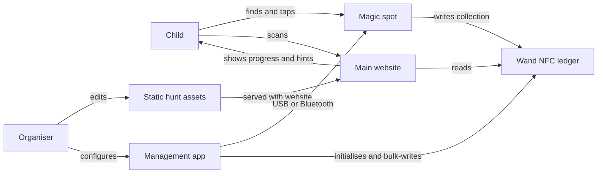
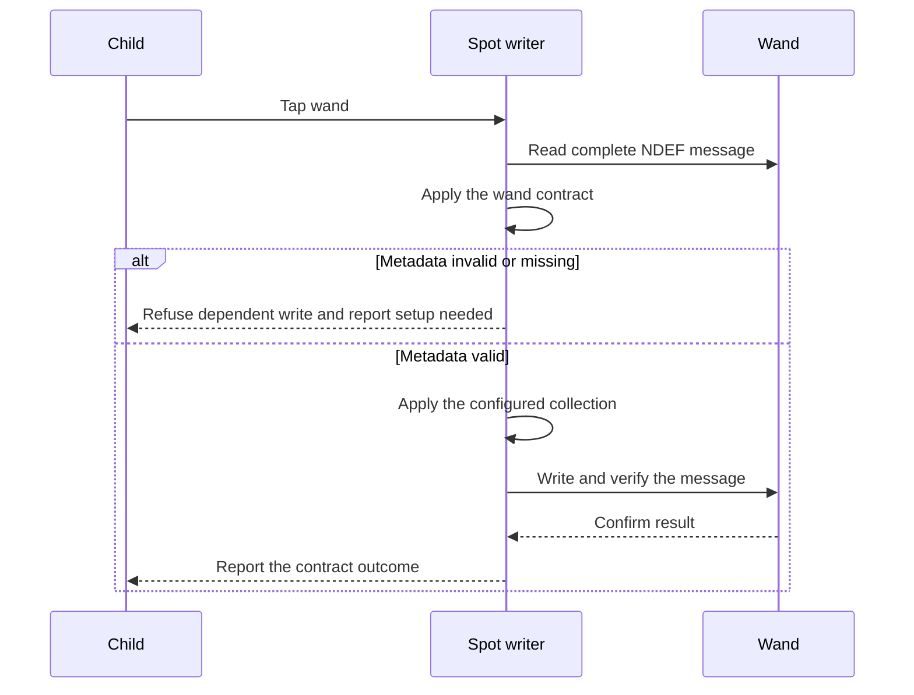
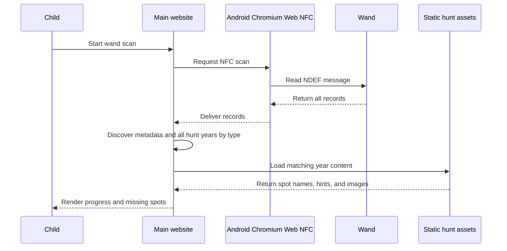

# System architecture and data flows

This document is the canonical description of module seams and runtime flows. Byte-level details belong in [wand-nfc-data-contract.md](wand-nfc-data-contract.md).

## System context

## Responsibility seams

### `website/`

The main website owns:

- Wand scan UX and browser compatibility messaging
- Hunt progress and hint presentation
- Static hunt asset loading
- Toybox writes to the user-controlled Record 1 action

The management app owns:

- Wand initialisation
- Approved bulk writes
- Spot configuration over USB or Bluetooth
- Deliberate debug and test operations

The website does not own hunt-state writes. The management app is an operational surface, not a bypass around the protocol safety gates.

### Shared NFC session context

Each frontend entry point provides one shared NFC session store/context per browser document. Pages consume that shared context instead of constructing independent NFC controllers.

`website/src/composables/nfcSession.ts` owns the browser scan/write lifecycle, cancellation, and normalized failure outcomes. The adapter-neutral wand ledger codec owns record normalization and ledger decoding; `useNfc` provides the thin website integration.

### `arduino/`

The current ESP32-C3 / LOLIN C3 Mini spot writer owns:

- PN532 reader operation
- Configured spot ID and hunt year
- Metadata validation before dependent writes
- Idempotent hunt-record updates
- Capacity and safe-read checks where hardware permits
- Operator feedback and diagnostics

The Wemos D1 Mini / ESP8266 sketches are legacy variants. They do not change the current contract.

### Shared contract

The website and firmware share the [wand NFC data contract](wand-nfc-data-contract.md). That contract owns record discovery, validation gates, preservation rules, and write outcomes.

## Spot collection flow

## Main website scan flow

The main website does not mutate hunt records. Toybox Record 1 writes are the only user-facing website writes.

## Management flow

The management app prepares and operates the system:

1. Initialise a blank wand with Record 1 and valid metadata.
2. Configure each spot writer with a hunt year and spot ID.
3. Verify a spot with an initialised wand.
4. Perform approved bulk writes or debug corrections deliberately.
5. Report failures according to the [wand NFC data contract](wand-nfc-data-contract.md).

## Multi-year behavior

One wand can carry Record 1, metadata, and multiple yearly hunt records. A reader must discover hunt records by `x-hunt:<YYYY>`, not by physical order. The website loads the corresponding year folder for each discovered record and keeps the years separate in the user interface.

## Hunt asset delivery

Organisers edit `website/public/hunts/<YYYY>/hunt.json` and its `images/` folder. The folder-level [hunt asset guide](../../website/public/hunts/README.md) is the canonical content authoring reference. No server-side hunt database is required.

## Failure and safety behavior

- Spot writers and management flows follow the validation, safe-read, capacity, preservation, and verification rules in the [wand NFC data contract](wand-nfc-data-contract.md).
- Operational surfaces expose refusal, success, duplicate, and partial-result states instead of hiding an unsafe or ambiguous write.
- Unsupported browser or device combinations receive a clear scanner compatibility message.
