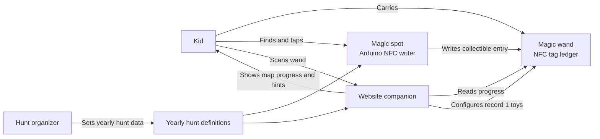
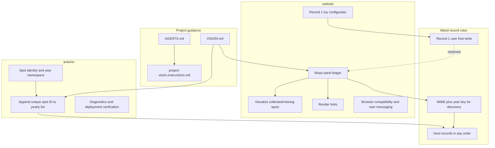
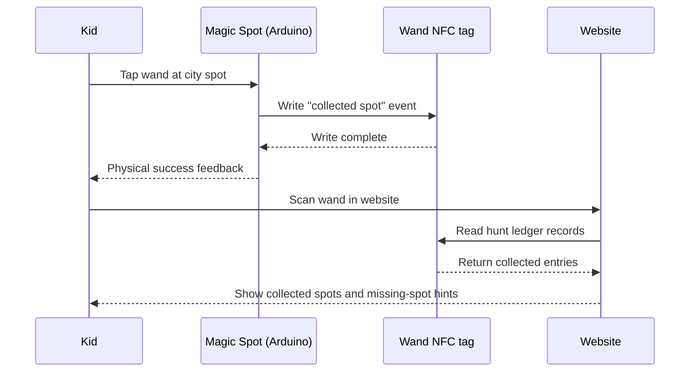
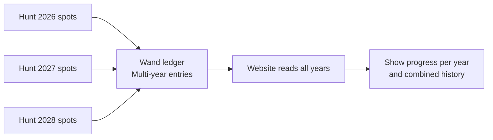
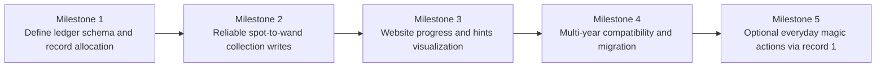

# Tryllestavsprojekt Schematics

This document visualizes the current intended system shape and delivery sequence.

## System Context



## Responsibility Boundaries



## Hunt Interaction Flow



## Seasonal Continuity



## Wand Ledger Data Model

```mermaid
flowchart TB
  R1[Record 1\nUser toy action] --> EX1[URL, text, or common NFC action]

  H1[Hunt record\nMIME: app/vnd.tryllestav.hunt\nYear: 2026\nSpot IDs: [s1,s3,s9]]
  H2[Hunt record\nMIME: app/vnd.tryllestav.hunt\nYear: 2027\nSpot IDs: [s2,s8]]
  H3[Hunt record\nMIME: app/vnd.tryllestav.hunt\nYear: 2028\nSpot IDs: []]

  Note1[Physical order may vary]
  Note2[Website discovers by MIME and year]
  Note3[Spot appends only when ID is missing]

  H1 --> Note1
  H2 --> Note1
  H3 --> Note1
  Note1 --> Note2 --> Note3
```

## Delivery Milestones


